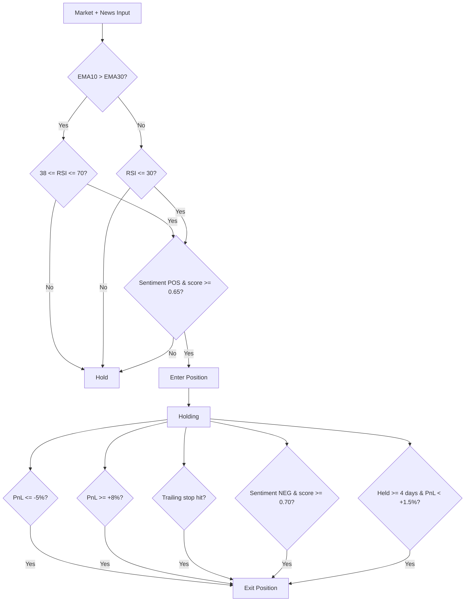

## 🧠 Strategy Overview

### Core Logic
This strategy combines three ideas: **following the trend**, **buying short-term rebounds**, and **using news sentiment as confirmation**.

In simple terms, the system tries to buy when the market is moving upward or when price temporarily drops but news sentiment remains positive. The goal is not to catch every move, but to enter higher-probability situations and exit quickly when conditions worsen.

The strategy focuses more on **stability and risk control** than on aggressive growth.

---

### Entry Conditions (Buy)

A position is opened when one of the following situations happens.

#### 1. Trend Entry
The market is already moving up and conditions support continuation:

- Short-term trend is stronger than long-term trend (EMA10 > EMA30)
- RSI shows momentum but is not overbought (between 38 and 70)
- News sentiment is positive
- Sentiment confidence is at least 0.65

This allows the strategy to participate in ongoing upward movements.

#### 2. Oversold Bounce Entry
The market has fallen and may rebound:

- RSI is below 30 (oversold condition)
- News sentiment is still positive
- Sentiment confidence is at least 0.65

This captures short recoveries after sharp drops.

---

### Exit Conditions (Sell)

A position is closed whenever risk increases or the expected move has already happened:

- The loss reaches about **5%** (stop loss)
- The profit reaches about **8%** (take profit)
- Price drops roughly **5%** from its highest level after entry (trailing stop)
- News sentiment turns clearly negative
- The trade lasts more than 4 days without meaningful profit

These rules help protect capital and keep trades short and controlled.

---

### Decision Flowchart

