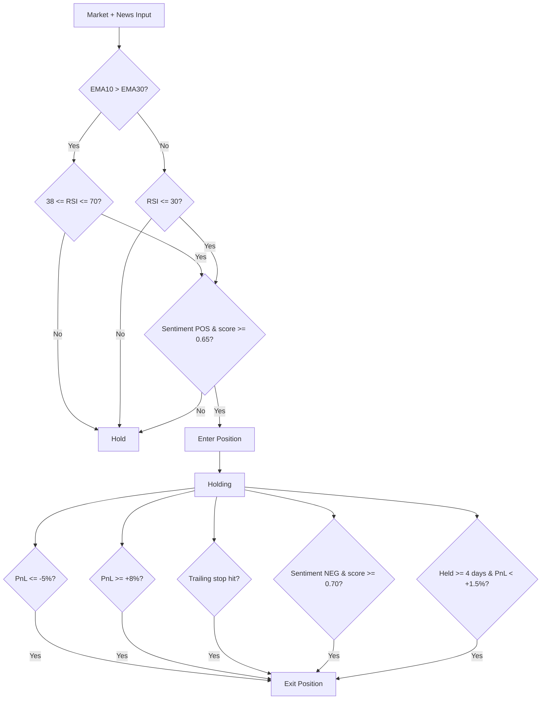

## 🧠 Strategy Overview

### Core Logic
This strategy combines **trend following**, **oversold rebounds**, and **news sentiment**.

In simple terms, the system tries to buy when the market is moving upward or when price drops temporarily but news sentiment remains positive. The focus is on consistency and protecting capital rather than aggressive growth.

---

### Entry Conditions (Buy)

A position is opened when:

- The market shows an upward trend and momentum is healthy, and news sentiment is positive
- The market is oversold (RSI below 30) but sentiment remains positive, suggesting a possible short-term rebound.
- An EMA is an average price that gives more importance to recent prices, and in this strategy it is used to check if the market is moving upward before allowing a buy.

---

### Exit Conditions (Sell)

A position is closed when:

- Loss reaches about **5%**
- Profit reaches about **8%**
- Price drops from its recent peak (trailing stop)
- News sentiment turns clearly negative
- The position stays open too long without meaningful profit

These rules help limit losses and avoid staying in weak trades.

---

### Decision Flowchart

## 📊 Performance Analysis

### Results

| Metric | Value |
|---|---|
| Total Transactions | 94 |
| Total Orders | 45 |
| Win Rate | 51.11% |
| Profit Factor | 2.44 |
| Total Return | 3.50% |
| Sharpe Ratio | 1.90 |
| Max Drawdown | -1.36% |
| Final Balance | $10,349.94 |

---

## ✅ Strengths

- Very low drawdown shows strong risk control
- Balanced win rate (~51%) typical for systematic strategies.
- Multiple exit rules help avoid large losses.
- Sentiment helps filter weaker trades.

---

## ⚠️ Limitations & Learnings

- Returns are moderate due to conservative exits.
- Some profitable trends may be exited too early.
- Performance depends on the quality of sentiment data. For further versions is mandatory to use LLM instead of just focusing on keywords.
